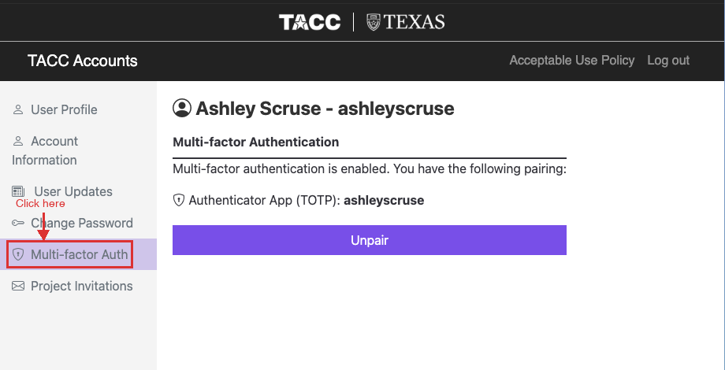
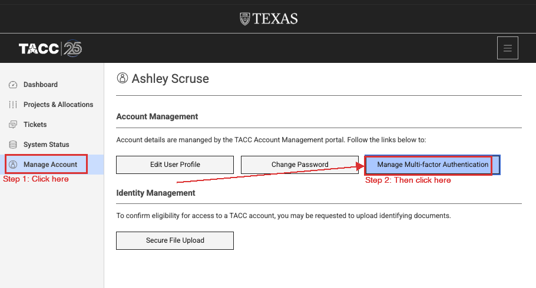

# Getting Started with the Morehouse Supercomputing Facility (MSCF)

Welcome to MSCF! While we build out our own supercomputing infrastructure, we are using resources at the **Texas Advanced Computing Center (TACC)** to provide HPC access to our researchers. MSCF is not hosted at TACC — TACC is a partner providing compute time while our facility is under development.

This guide walks you through everything you need to get set up on TACC and run your first job.

---

## Step 1: Create Your TACC Account

After you submit the access request form, the allocation manager will add you to the project. You'll receive an email from TACC with the subject line:

> **"TACC Project Invitation Action Required: Account Request"**

Here's what to do:

1. **Open the invitation email** and click the link to create your account
2. Fill out the registration form:
   - Use your **institutional email** (e.g., @morehouse.edu)
   - Choose a username you'll remember — this is what you'll use to log in
   - Set a strong password
3. Complete the account verification if prompted

> **Important:** You must use the link in the invitation email — do not go to the TACC portal separately. The invitation link connects your new account to the project allocation automatically.

---

## Step 2: Set Up Multi-Factor Authentication (MFA)

TACC requires MFA for all logins. Set this up **before** trying to SSH in.

> **Do NOT use SMS/text messages for MFA.** Use an authenticator app instead.

There are two ways to get to the MFA setup page:

**Option A:** Go directly to **TACC Accounts** at [accounts.tacc.utexas.edu](https://accounts.tacc.utexas.edu/) and click **Multi-factor Auth** in the sidebar.



**Option B:** Log in to the **TACC User Portal** at [portal.tacc.utexas.edu](https://portal.tacc.utexas.edu/), click **Manage Account** in the sidebar, then click **Manage Multi-factor Authentication**.



Once you're on the MFA page, set up an **authenticator app** — here are our recommended options:

- **Okta Verify** (recommended) — [iOS](https://apps.apple.com/app/okta-verify/id490179405) / [Android](https://play.google.com/store/apps/details?id=com.okta.android.auth)
- **Duo Mobile** — [iOS](https://apps.apple.com/app/duo-mobile/id422663827) / [Android](https://play.google.com/store/apps/details?id=com.duosecurity.duomobile)

4. Follow the on-screen instructions to pair your device
5. Test it by logging out and back in to the portal

---

## Step 3: Log In via SSH

Once your account is active and MFA is set up, connect to the system.

### On Mac or Linux (Terminal)

Open your terminal and run:

```bash
ssh your_username@system_hostname.tacc.utexas.edu
```

The part after `@` is the **hostname of the system you want to access**, followed by `.tacc.utexas.edu`. Replace it with the correct one from the table below. For example, to connect to Lonestar6:

```bash
ssh your_username@ls6.tacc.utexas.edu
```

When prompted:

1. Enter your **TACC password**
2. Enter your **MFA token** (from your authenticator app)

> **Note:** When you type your password and MFA token, nothing will appear on the screen — no characters, no asterisks, no dots. This is normal. The terminal is still receiving your input. Just type carefully and press Enter.

### On Windows

Use one of these SSH clients:

- **Windows Terminal / PowerShell** (Windows 10+): Same `ssh` command as above
- **PuTTY**: Download from https://www.putty.org/, enter the hostname, and connect
- **MobaXterm**: Download from https://mobaxterm.mobatek.net/ (recommended for beginners — includes a file browser)

### System Hostnames

| System    | Hostname      | Details |
| --------- | ------------- | ------- |
| Lonestar6 | `ls6`       | [System specs](https://docs.tacc.utexas.edu/hpc/lonestar6/) |
| Frontera  | `frontera`  | [System specs](https://docs.tacc.utexas.edu/hpc/frontera/) |
| Stampede3 | `stampede3` | [System specs](https://docs.tacc.utexas.edu/hpc/stampede3/) |
| Vista     | `vista`     | [System specs](https://docs.tacc.utexas.edu/hpc/vista/) |

> Not sure which system to use? Check the system specs linked above to see which one fits your workload.

---

## Step 4: Understand the File System

TACC systems have three main storage areas. Know which to use:

| Location           | Path                        | Purpose                    | Quota    | Backed Up?                 | Purged?                         |
| ------------------ | --------------------------- | -------------------------- | -------- | -------------------------- | ------------------------------- |
| **$HOME**    | `/home1/0xxxx/username`   | Config files, scripts      | ~10 GB   | Yes — backed up regularly | No                              |
| **$WORK**    | `/work2/0xxxx/username`   | Code, libraries, datasets  | ~1 TB    | No — not backed up        | No                              |
| **$SCRATCH** | `/scratch/0xxxx/username` | Active job I/O, temp files | No limit | No — not backed up        | Yes — files unused for 10 days |

> **Important:** `$SCRATCH` is **not permanent storage**. Files that have not been accessed in 10 days are automatically purged. Do not store anything there that you can't afford to lose. `$WORK` is also not backed up, so keep your own copies of critical data.

**Rule of thumb:**

- Put your code and input data in `$WORK`
- Run jobs that write output to `$SCRATCH`
- Keep only essential config in `$HOME`

---

## Step 5: Load Software Modules

TACC uses the **Lmod module system** to manage software. Nothing is loaded by default.

```bash
# See what's available
module avail

# Search for specific software
module spider python

# Load a module
module load python3/3.11

# See what you have loaded
module list

# Unload a module
module unload python3

# Reset to defaults
module reset
```

Common modules you might need:

```bash
module load python3       # Python
module load gcc           # GNU compilers
module load cuda          # GPU computing (if applicable)
module load intel         # Intel compilers
module load mvapich2      # MPI for parallel computing
```

---

## Step 6: Submit Your First Job

TACC uses the **Slurm** workload manager. You do NOT run compute-heavy work on the login node — you submit it as a job.

### Create a Job Script

Create a file called `my_first_job.sh`:

```bash
#!/bin/bash
#SBATCH -J my_test_job          # Job name
#SBATCH -o my_test_job.%j.out   # Output file (%j = job ID)
#SBATCH -e my_test_job.%j.err   # Error file
#SBATCH -p normal               # Queue/partition (normal, development, gpu, etc.)
#SBATCH -N 1                    # Number of nodes
#SBATCH -n 1                    # Number of tasks
#SBATCH -t 00:10:00             # Wall clock time (HH:MM:SS)
#SBATCH -A YOUR_ALLOCATION       # Allocation/account name — provided by the allocation manager

echo "Job started at $(date)"
echo "Running on node: $(hostname)"
echo "Hello from TACC!"

# Replace the lines below with your actual work
module load python3
python3 -c "print('Python is working on TACC!')"

echo "Job finished at $(date)"
```

### Submit the Job

```bash
sbatch my_first_job.sh
```

### Monitor Your Job

```bash
# Check job status
squeue -u $USER

# Get detailed job info
scontrol show job <job_id>

# Cancel a job
scancel <job_id>
```

### Check Output

Once the job completes, check the output and error files:

```bash
cat my_test_job.<job_id>.out
cat my_test_job.<job_id>.err
```

---

## Step 7: Transfer Files

If your files are hosted online (Google Drive, GitHub, Dropbox, a web server, etc.), you can download them directly to TACC using `wget`:

```bash
cd $WORK
wget https://example.com/link-to-your-file.zip
```

To download from **Google Drive**, use the shareable link with `wget`:

```bash
wget -O my_file.zip "https://drive.google.com/uc?export=download&id=YOUR_FILE_ID"
```

> **Tip:** The `YOUR_FILE_ID` is the long string of characters in your Google Drive sharing link between `/d/` and `/view`.

### Downloading Datasets from the Web

You can use `wget` to pull publicly available datasets directly onto TACC — no need to download to your laptop first and then re-upload.

```bash
# Download a file from any public URL
cd $WORK
wget https://data.example.org/dataset.csv

# Download and rename the file
wget -O my_data.csv https://data.example.org/some-long-filename.csv

# Download an entire directory listing (use with caution)
wget -r -np -nH --cut-dirs=1 https://data.example.org/my-dataset/
```

This works with any publicly accessible URL — research data repositories, government datasets, course materials, etc. As long as the file has a direct download link, `wget` can grab it.

---

## Common Slurm Queues

| Queue           | Max Nodes | Max Time | Use Case                          |
| --------------- | --------- | -------- | --------------------------------- |
| `development` | 4         | 2 hours  | Testing and debugging             |
| `normal`      | 256       | 48 hours | Standard production jobs          |
| `gpu-a100`    | varies    | 48 hours | GPU workloads (check your system) |
| `large`       | 512+      | 48 hours | Large-scale parallel jobs         |

> Queue names and limits vary by system. Run `sinfo` to see available queues on your system.

---

## Quick Reference

| Task                     | Command                                        |
| ------------------------ | ---------------------------------------------- |
| Log in                   | `ssh user@system_hostname.tacc.utexas.edu`   |
| Check allocation balance | `allocations` or `/usr/local/etc/taccinfo` |
| See available modules    | `module avail`                               |
| Load Python              | `module load python3`                        |
| Submit a job             | `sbatch script.sh`                           |
| Check your jobs          | `squeue -u $USER`                            |
| Cancel a job             | `scancel <job_id>`                           |
| Check disk usage         | `du -sh $WORK`                               |
| Download files to TACC   | `wget https://your-link-here`                |

---

## Getting Help

- **TACC Documentation**: https://docs.tacc.utexas.edu/
- **TACC Support Ticket**: https://portal.tacc.utexas.edu/tacc-consulting
- **Allocation Questions**: Contact Ashley Scruse — [ashley.scruse@morehouse.edu](mailto:ashley.scruse@morehouse.edu)

---

## Checklist Before You Start Computing

- [ ] Received TACC project invitation email
- [ ] Created TACC account using the invitation link
- [ ] MFA set up and tested
- [ ] Successfully SSH'd into the system
- [ ] Ran a test job with `sbatch`

Once all boxes are checked, you're ready to go!
